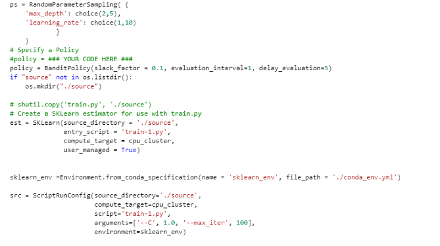
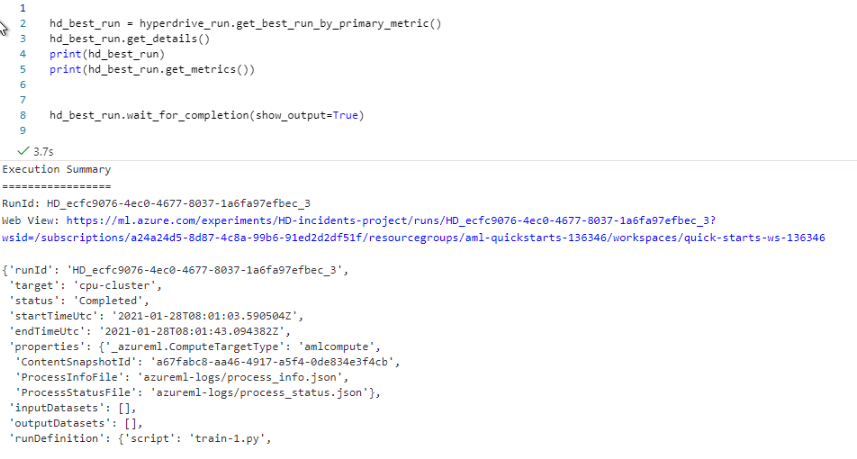

# Azure-ML-Capstone

## Incident Management Process - Event Log

TODO: Write a short introduction to your project.

Project Set Up and Installation
OPTIONAL: If your project has any special installation steps, this is where you should put it. To turn this project into a professional portfolio project, you are encouraged to explain how to set up this project in AzureML.

## Dataset

### Data Set: [Dataset](https://archive.ics.uci.edu/ml/machine-learning-databases/00498/)
Overview
The incident management log data is retrieved from UCI Machine learnig data set. [Incident Data)https://archive.ics.uci.edu/ml/datasets/Incident+management+process+enriched+event+log. The data is sourced from a Servicenow platform for IT service management.

This provides details of various incidents recorded over period of time . I have taken up this project to predict ETA(expected time of accomplishment) to understand time to resolve each incident. This helps IT department to provide ETA for customers based on time taken to resolve similar issues historically. This will also help IT department to understand if any instance will go beyond expected SLA.

#### Dataset details
** Number of instances   : 141712
   No of Characteristics : 36
   Dataset Type          : Characteristics
   Dependent Variable    : Time to close 
   
#### Task
This event log is extracted from Servicenow plotform instance of IT service management.
Some of the important attributes are 
Incident Number : An identifier of incident
Incident State : The status of incident in its life cycle like : created, open , assigned , resolved , closed etc..
Category, Sub category : Helps to identify or classify the type of incident
Impact : Provides if it has high , medium or low impact
Urgency , Priority : provides Urgency and priority of the incident to resolve
Created on , opened on, resolved on, closed on : Provides the timestamp details of the progress to resolve or close the task.
*b Target Variable b*
Time to close : The calculated variable to get time needed to close the task in hours 
                This is calculated as difference between time to close and time to create a task .

Access
The data is accessed from url : https://archive.ics.uci.edu/ml/datasets/Incident+management+process+enriched+event+log
The CSV file is extracted from Zip file obtained form the URL.
The incidents that have the status as 'closed' are considered for model to predict time to close an incident.
The sample data set used is : 

## Automated ML
Auto ML is used to train the model and view the results of the metrics obtained.

The following tasks are done :
**b Connectyour workspaceand createan experiment
**b Load data and train scikit-learn models
**b View training results in thestudio
**b Retrievethe best model

## Connect workspaceand createexperiment

## HD Run

22_BestRunDetails.PNG)

## deployment

Results
TODO: What are the results you got with your automated ML model? What were the parameters of the model? How could you have improved it?

TODO Remeber to provide screenshots of the RunDetails widget as well as a screenshot of the best model trained with it's parameters.

Hyperparameter Tuning
TODO: What kind of model did you choose for this experiment and why? Give an overview of the types of parameters and their ranges used for the hyperparameter search

Results
TODO: What are the results you got with your model? What were the parameters of the model? How could you have improved it?

TODO Remeber to provide screenshots of the RunDetails widget as well as a screenshot of the best model trained with it's parameters.

Model Deployment
TODO: Give an overview of the deployed model and instructions on how to query the endpoint with a sample input.

Screen Recording
TODO Provide a link to a screen recording of the project in action. Remember that the screencast should demonstrate:

A working model
Demo of the deployed model
Demo of a sample request sent to the endpoint and its response
Standout Suggestions
TODO (Optional): This is where you can provide information about any standout suggestions that you have attempted.
